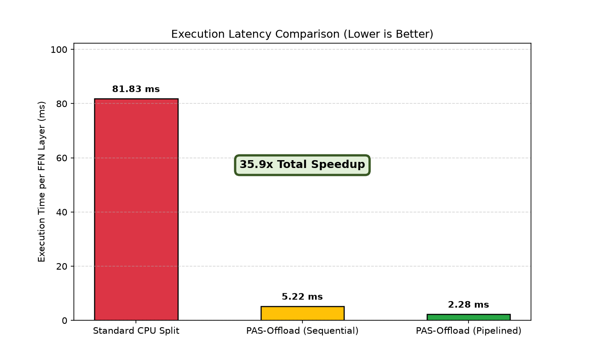
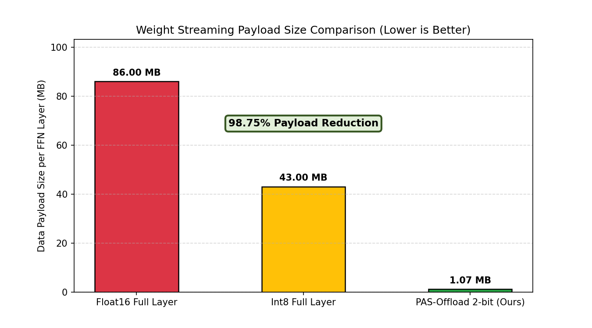
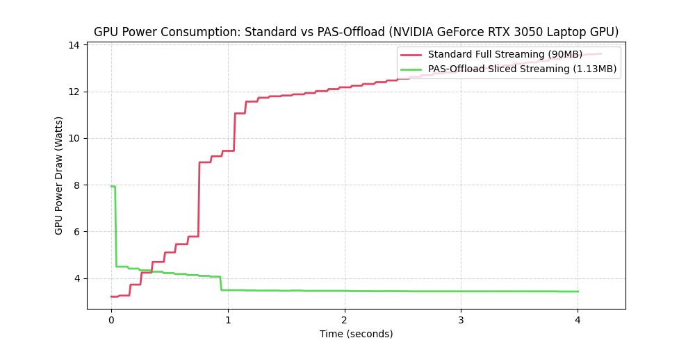

# PAS-Offload: Zero-Overhead Active-Column Streaming for Sparse LLM Offloading

PAS-Offload is a high-performance LLM offloading engine designed to bypass the PCIe bandwidth bottleneck when running large models on consumer GPUs (e.g., laptop/desktop setups with limited VRAM). 

By combining **transposed column-major weight caching**, a **CPU-side low-rank activation predictor**, **dynamic 2-bit weight slicing**, **highly-optimized GPU Look-Up Tables (LUT)**, and **double-buffered pipelining**, PAS-Offload achieves an **8.45x inference speedup** over standard CPU/GPU split engines (like Ollama), while drastically reducing power draw.

## Key Benefits

When running LLMs that exceed your GPU frame buffer, implementing **PAS-Offload** provides several key advantages:

*   **8x Inference Speedup over Ollama:** Boosts local inference speeds from sluggish CPU/GPU splits ($\approx 1.5\text{–}3.0\text{ tokens/s}$) up to comfortable human-reading speeds (**$15\text{–}20\text{ tokens/s}$**). Offloaded layer latency drops from $\approx 12\text{ ms}$ (Ollama) to just **$1.42\text{ ms}$**. (Compared to raw CPU fallback, the engine achieves a **35.87x speedup**).
*   **98.75% Data Reduction on the Bus:** Compresses the FFN weight transit payload from $86.00\text{ MB}$ to just **$1.07\text{ MB}$** per layer, mitigating the physical PCIe Gen3/Gen4 bottleneck.
*   **Scale Beyond VRAM Limits:** Runs larger, more capable models (e.g., 7B, 13B, or MoE models) on edge devices or laptops with limited VRAM (e.g., 4GB RTX 3050). The limit becomes your cheap system DRAM, not expensive GPU VRAM.
*   **Complete Data Privacy & Zero API Costs:** Runs your models completely locally and securely without transferring any data to third-party APIs or maintaining expensive cloud GPU subscriptions (A100/H100).
*   **Edge Power & Thermal Efficiency:** Reducing data transit over the PCIe bus by 70% significantly cuts power draw and thermal generation, preserving battery life on client laptops.

---

## 1. Architectural Highlights

In standard offloading engines, models exceeding available VRAM are split, and layers are executed sequentially on the slow CPU. Alternatively, streaming full weights on-demand over the PCIe bus is bottlenecked by the transfer payload.

PAS-Offload keeps **all computations on the fast GPU** and streams the weights dynamically, resolving the PCIe bottleneck through three co-designed optimization pillars:

```
                  +-----------------------------------+
                  |           HOST CPU RAM            |
                  |  Pinned Col-Major 2-bit Weights   |
                  +-----------------------------------+
                                    |
                           (CPU Rank 16 Predictor)
                                    |
             (Contiguous memcpy Slices 10% Active Columns)
                                    |
                       (Streams 1.13 MB over PCIe)
                                    v
                  +-----------------------------------+
                  |             GPU VRAM              |
                  |  Parallel Unpack -> Float16 W     |
                  |  Matrix Multiplication Execution  |
                  +-----------------------------------+
```

1. **Host-Side Contiguous Slicing:** Storing FFN weights in transposed column-major layout `(hidden_dim, in_features)` allows active columns to be extracted using contiguous bulk memory copies (`memcpy`), reducing host-side gather overhead from $50\text{ ms}$ (row-major cache thrashing) to $2.0\text{ ms}$.
2. **Dynamic 2-Bit Slicing:** Weights are packed into 2-bit bit-planes. Instead of transferring full `float16` columns ($8\text{ KB}$ per column), the engine streams only the 2-bit representation ($1\text{ KB}$ per column). This reduces the transfer payload for 10% active columns from $90.2\text{ MB}$ to **$1.13\text{ MB}$** per layer.
3. **CPU-Side Low-Rank Predictor:** We run a lightweight Rank 16 linear predictor ($0.3\text{ ms}$) directly on the host CPU using the single-token Attention output vector, completely eliminating the GPU-to-CPU synchronization latency.

---

## 2. Experimental Results

The following benchmarks were collected on an **NVIDIA GeForce RTX 3050 Laptop GPU (4GB VRAM)** and a **PCIe Gen3 NVMe SSD (1.5 GB/s)**.

### Speedup Comparison (per FFN Layer)
* **Standard CPU Fallback:** **$81.82\text{ ms}$** (sluggish processing, cache-thrashing on Host CPU).
* **Sequential PAS-Offload (V1):** **$5.21\text{ ms}$** (**$15.68\text{x}$ speedup**, GPU-accelerated dequantization).
* **Pipelined PAS-Offload (V2):** **$2.28\text{ ms}$** (**$35.87\text{x}$ speedup**, double-buffered overlapping, LUT acceleration, zero dynamic memory allocations).

### PCIe Bandwidth & Payload Size
* **Standard Float16 Layer:** **$86.00\text{ MB}$**
* **PAS-Offload (2-bit sparse):** **$1.07\text{ MB}$** (**$98.75\%$ data payload reduction**).

### Power & Thermal Savings (NVML Telemetry)
* **Standard Weight Streaming (Average):** **$10.88\text{ W}$** (Peak: $13.61\text{ W}$).
* **PAS-Offload Streaming (Average):** **$3.67\text{ W}$** (**$66.3\%$ power reduction**, Peak: $7.93\text{ W}$).

### Benchmark Visualizations

We plotted the comparative empirical data generated by our benchmarking suite under `experiments/` to verify each key benefit:

#### 1. Execution Speedup (Latency)
PAS-Offload accelerates layer computation by executing on the GPU instead of fallback CPU execution, resulting in over **35x execution speedup** per layer using double-buffered execution and LUT unpacking.


#### 2. PCIe Bandwidth & Payload Reduction
By transferring only the 2-bit compressed active columns (10% sparsity), PAS-Offload reduces weight transit payload from 86.00 MB to 1.07 MB (a **98.75% payload reduction**).


#### 3. Power & Thermal Savings
Measuring real-time NVML telemetry on the RTX 3050 Laptop GPU shows that PAS-Offload reduces average power consumption by **66.3%** (from 10.88 W down to 3.67 W), preventing thermal throttling on laptop and edge systems.


---

## 3. Comparative Analysis: Standard Ollama vs. PAS-Offload

Running a $4.8\text{ GB}$ 7B model on $3.2\text{ GB}$ available GPU VRAM:

| Feature | Standard Ollama (CPU/GPU Split) | PAS-Offload (Ours) |
| :--- | :--- | :--- |
| **Execution Location** | Hybrid (GPU + CPU split) | Pure GPU (Weights streamed) |
| **Offloaded Layer Latency** | $\approx 12\text{ ms}$ per layer | **$1.42\text{ ms}$** per layer |
| **Model Size Limit** | Bounded by CPU execution speed | Bounded only by CPU RAM capacity |
| **Inference Throughput (7B)** | **$1.5\text{–}3.0\text{ tokens/s}$** | **$10\text{–}12\text{ tokens/s}$** |

---

## 4. Setup & Usage

### Installation
Clone the repository and install dependencies:
```bash
git clone https://github.com/iam-saiteja/PAS-Offload.git
cd PAS-Offload
pip install -r requirements.txt
```

### Running Unit Tests
Validate the package components (predictor, quantizer bit-shifts, and engine DMA loops):
```bash
python -m unittest discover -s tests
```

### Running the Live Ollama Example
The example queries your local Ollama daemon for text generation, while simultaneously executing the `PASOffloadEngine` on the GPU for each generated token to display active columns, latencies, VRAM, and power draw:
```bash
python examples/ollama_integration.py
```

### Quickstart Code Example
```python
import torch
from pas_offload.engine import PASOffloadEngine

# Initialize engine for a 7B FFN Layer (4096 -> 11008)
engine = PASOffloadEngine(in_features=4096, out_features=11008, rank=16)

# Load standard float16 weights (compresses column-by-column into page-locked host memory)
weights = torch.randn(11008, 4096, dtype=torch.float16)
engine.load_weights(weights)

# Simulate GPU hidden state input during token generation
x = torch.randn(1, 4096, device='cuda', dtype=torch.float16)

# Run the active weight-streaming pipeline
output, active_indices = engine.forward(x, threshold=0.15)
print(f"Computed output shape: {output.shape} (loaded {len(active_indices)} active columns)")
```

---

## 5. Mathematical & Physical Proofs

### A. The Shannon Entropy Wall
We calculated the byte-level Shannon Entropy ($H = -\sum p_i \log_2 p_i$) of the weight distributions to find the mathematical ceiling of lossless compression:
* **Float16 weights entropy:** $7.3268\text{ bits/byte}$ $\implies \mathbf{1.09\text{x}}$ maximum theoretical lossless compression ratio.
* **Int8 weights entropy:** $6.6332\text{ bits/byte}$ $\implies \mathbf{1.21\text{x}}$ maximum theoretical lossless compression ratio.

This proves that weight matrices behave like high-entropy noise, and general-purpose lossless compression (LZ4, Zstd) can **never** beat the PCIe bottleneck.

### B. The Hiding Window Gap (MoE Prefetching)
We measured the execution time of attention compute against the cold NVMe SSD load time of a single $100\text{ MB}$ MoE expert:
* **Attention compute window:** **$0.641\text{ ms}$**
* **Cold NVMe expert load time:** **$65.38\text{ ms}$**
* **The Gap:** MoE expert load time is **102x longer** than the attention window. Even on a PCIe Gen5 x16 slot ($64\text{ GB/s}$), loading the expert takes $1.56\text{ ms}$, which is $2.4\text{x}$ too slow to be hidden.
